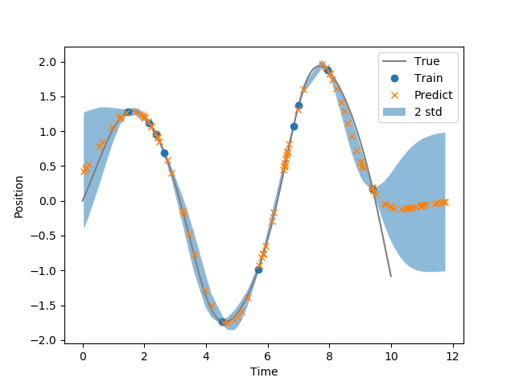

This is a simple implementation of a Gaussian process (GP) used to approximate a Van Der Pol oscillator. 

Here's a figure showing the GP's predictions for position given 10 training points. 
The ribbon plot shows the predicted uncertainty.

Checkout `script.py` for the implementation. 

